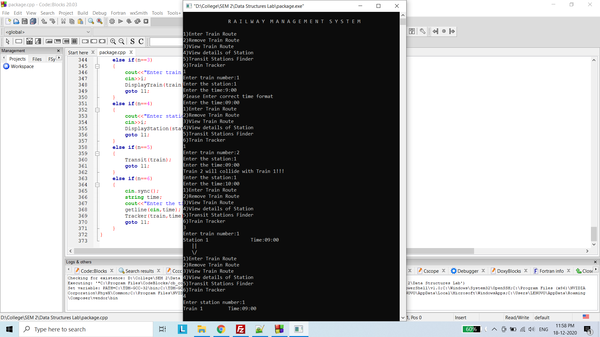
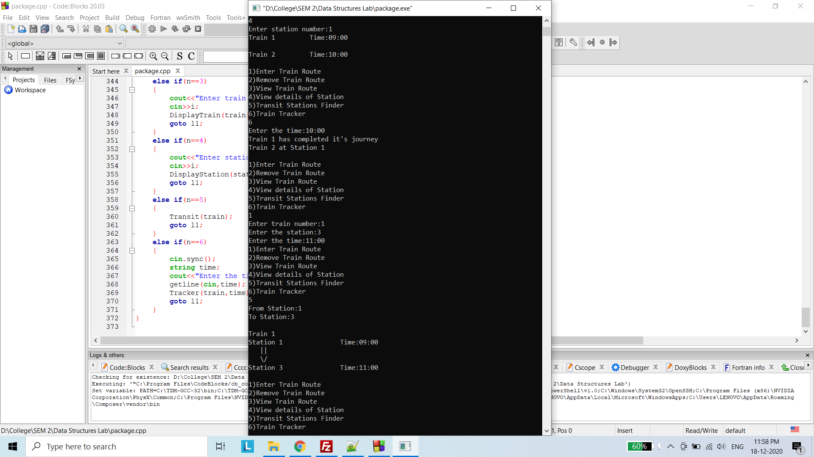

# Railway Management Software
A railway management software to track trains and its routes developed using C++ and data structures.
## Data Structure used :
* Linked List
## Features :
* The routes of different trains can be stored like a Railway Database. For example, Train 1 will reach Station 1 at 9:00.
* An existing train route can be edited.
* The route of a desired train can be viewed.
* The details of a desired station can be acquired. For example, the list of trains that arrive at the station with their respective timings.
* Transit Stations Finder, that is to find the trains available between two stations.
* Train Tracker,that is to find the current location of trains.  

